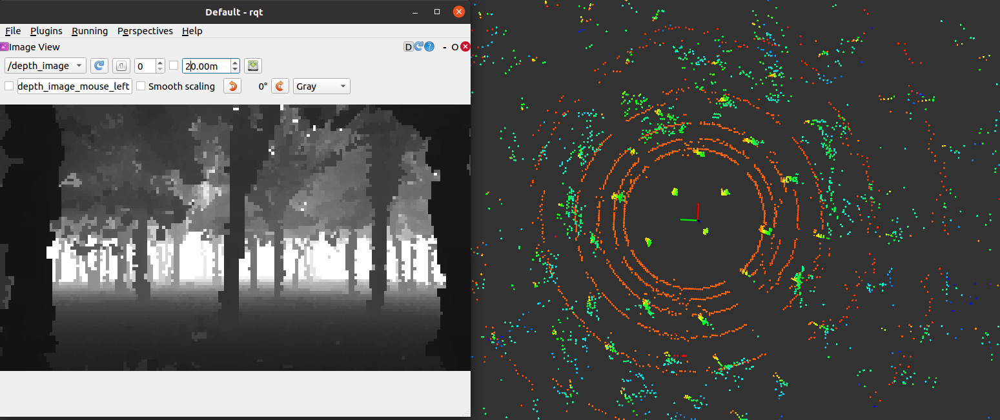
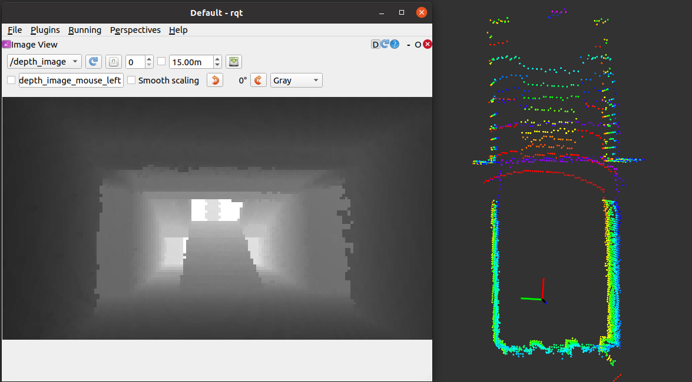

# 真实环境点云/深度图仿真(支持CUDA)

**依赖：**

ROS; OpenCV; PCL; yaml-cpp
```angular2html
sudo apt-get install libyaml-cpp-dev
```

**编译：**
```angular2html
catkin build
```

**运行：**
```angular2html
source devel/setup.bash
# CPU版本
rosrun sensor_simulator sensor_simulator
# GPU版本
rosrun sensor_simulator sensor_simulator_cuda
```

传感器参数以及点云环境修改见config

**仿真位置发布：**
```angular2html
cd src/sensor_simulator
python sim_odom.py

cd src/sensor_simulator
rviz -d rviz.rviz
```

**其他工具：**
```
点云裁剪、滤波预处理：cloudcompare软件
```

**DEMO:** 

cpu 版本 (i7-9700)：
深度图0.02s, 点云0.01s

gpu 版本 (GTX3060)：
深度图0.001s, 点云0.001s

**1. Forest**

**2. Building**

**3. GIF**


more environments are coming...

**注释:**
1. CPU版本地图有边界（可选择复制地图几份），GPU版本无边界