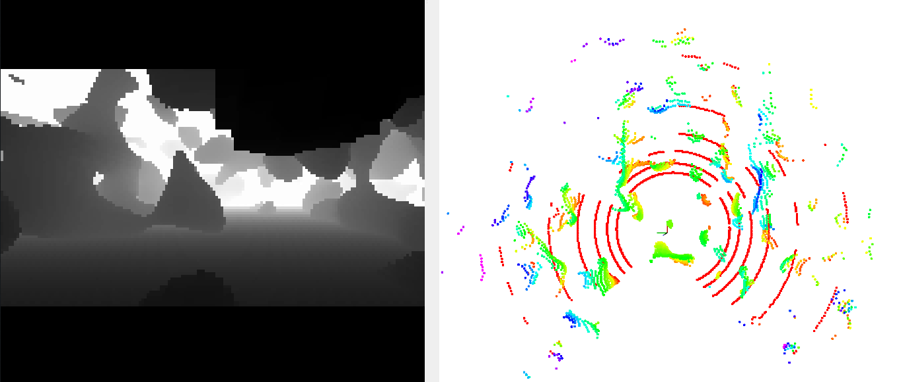

# 真实环境点云/深度图仿真(支持CUDA)

**1 依赖：**

ROS; OpenCV; PCL; yaml-cpp
```angular2html
sudo apt-get install libyaml-cpp-dev
```

**2 编译：**
```angular2html
git clone --depth 1 https://github.com/TJU-Aerial-Robotics/SensorSimulator
catkin build
```

**3 运行：**
```angular2html
source devel/setup.bash
# CPU版本 (已弃用)
rosrun sensor_simulator sensor_simulator
# GPU版本
rosrun sensor_simulator sensor_simulator_cuda
```

传感器参数以及点云环境修改见[config](config/config.yaml)，重要参数说明:
```
# 一些话题
odom_topic: "/sim/odom"
depth_topic: "/depth_image"
lidar_topic: "/lidar_points"
# 使用点云地图还是随机地图
random_map: true
# 点云地图文件
ply_file:
# 随机地图配置  
maze_type: 5   # 1: 溶洞 2: 柱子 3:迷宫 5:森林(也需设置树的点云文件) 6:房间
```

如果使用点云地图，可下载我们收集的一个树林的示例: [谷歌云盘](https://drive.google.com/file/d/1WT3vh0m7Gjn0mt4ri-D35mVDgRCT0mNc/view?usp=sharing)

**4 仿真位置发布：**
```angular2html
cd src/sensor_simulator
python sim_odom.py

cd src/sensor_simulator
rviz -d rviz.rviz
```

**5 其他工具：**
```
点云裁剪、滤波预处理：cloudcompare软件
```

**6.1 DEMO:** 

cpu 版本 (i7-9700)：
深度图0.02s, 点云0.01s

gpu 版本 (GTX3060)：
深度图0.001s, 点云0.001s

GPU版资源占用(开30HZ)：


**6.2 示例场景**

<table>
  <tr>
    <td align="center">
      
      <p>1. realworld forest</p>
    </td>
    <td align="center">
      
      <p>2. realworld building</p>
    </td>
  </tr>
  <tr>
    <td align="center">
      
      <p>3. 3D perlin</p>
    </td>
    <td align="center">
      
      <p>4. random forest</p>
    </td>
  </tr>
  <tr>
    <td align="center">
      
      <p>5. random room</p>
    </td>
    <td align="center">
      
      <p>6. random maze</p>
    </td>
  </tr>
</table>

**6.3 GIF DEMO**


more environments are coming...

**注释:**

1. CPU版本地图有边界（可选择复制地图几份，已弃用），GPU版本无边界（推荐）

**acknowledgment**

部分地图（3D perlin, random maze）生成基于：
https://github.com/HKUST-Aerial-Robotics/mockamap